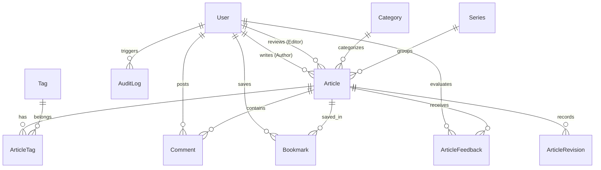

# 🏗️ Arsitektur Sistem & Database Engineering — SlashJournal

Dokumen ini menjelaskan rancangan arsitektur data relasional, pengindeksan performa, dan pemisahan kanal taksonomi.

---

## 1. Diagram Relasi Basis Data (ERD)

---

## 2. Struktur Model Terpadu

### A. Entitas `Article`
Menampung bab dokumentasi arsitektur dan naskah blog teknis:
- `title`, `slug`: URL bersih tanpa kategori atau tanggal (`B2b`).
- `excerpt`: Ringkasan padat untuk layar pertama dan kartu pratinjau (`K8`).
- `contentMarkdown`: Konten berstruktur yang mendukung blok diagram Mermaid, tabbed code, dan `[[WikiLink]]`.
- `status`: Alur kerja redaksi (`DRAFT`, `IN_REVIEW`, `PUBLISHED`, `ARCHIVED`).
- `isSponsored`, `sponsorName`, `sponsorUrl`: Penanda pos bersponsor (`M5`).
- `coverImageUrl`, `coverImageSourceType`: Atribusi jenis sumber visual (`C4` & `CM7`: Foto Sendiri, Stok Bebas, Ilustrasi AI Berlabel).
- `isIndexable`: Pengatur indexing Google untuk kanal privat (`KB2`).

### B. Entitas `Category` & `Series`
- **Category (Sub-Kanal)**: Pemisah jenis tulisan (*Rekayasa Sistem*, *Desain & Antarmuka*, *Jurnal Personal*).
- **Series (Seri Kurasi)**: Panduan multi-bagian yang terhubung berurutan.

### C. Entitas `AdSlot`
- Mengatur penempatan dinamis iklan slot per nama (`leaderboard`, `in_feed`, `sidebar_sticky`).

### D. Entitas `GlossaryTerm`
- Kamus konsep arsitektur A-Z yang menjadi rujukan definisi kartu popover `[[WikiLink]]`.
