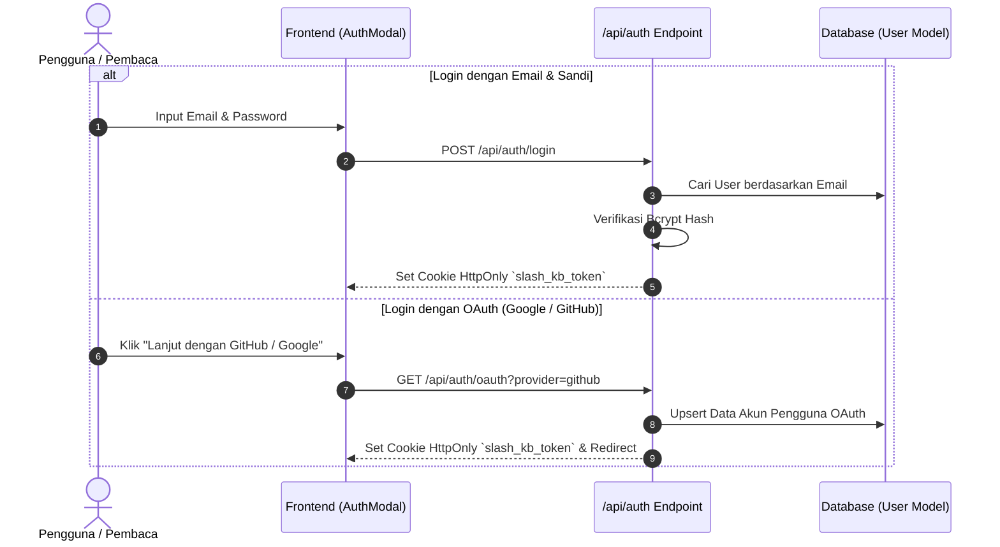

# 🔐 Keamanan, Autentikasi & Multi-Role RBAC

Dokumen ini menjelaskan rancangan keamanan otorisasi berbasis peran (Role-Based Access Control / RBAC), sesi cookie terisolasi, dan alur autentikasi ganda (Dual Authentication).

---

## 1. Matriks Hak Akses Peran (RBAC Matrix)

Platform SlashKB mendefinisikan 4 peran terisolasi:

| Fitur / Tindakan | READER | AUTHOR | EDITOR | ADMIN |
|---|:---:|:---:|:---:|:---:|
| Membaca Dokumentasi & Glosarium Publik | ✅ | ✅ | ✅ | ✅ |
| Pencarian Cepat (Ctrl+K) & Filter | ✅ | ✅ | ✅ | ✅ |
| Bookmark Dokumen Pribadi | ✅ | ✅ | ✅ | ✅ |
| Rating "👍/👎" & Reaksi Emoji | ✅ | ✅ | ✅ | ✅ |
| Kirim Komentar (Auto-Approved) | ✅ | ✅ | ✅ | ✅ |
| Tulis Dokumen Baru via Slash Editor | ❌ | ✅ | ✅ | ✅ |
| Ajukan Draf untuk Review (`IN_REVIEW`) | ❌ | ✅ | ✅ | ✅ |
| Akses Dashboard CMS (`/admin`) | ❌ | ✅ | ✅ | ✅ |
| Menyetujui / Menolak Draf di Review Queue | ❌ | ❌ | ✅ | ✅ |
| Terbitkan Dokumen Langsung (`PUBLISHED`) | ❌ | ❌ | ✅ | ✅ |
| Kelola Istilah Glosarium A-Z | ❌ | ❌ | ✅ | ✅ |
| Akses Telemetri Kesenjangan Pencarian | ❌ | ❌ | ✅ | ✅ |
| Tata Kelola Pengguna & Audit Keamanan | ❌ | ❌ | ❌ | ✅ |

---

## 2. Alur Autentikasi Ganda (Dual Authentication)

---

## 3. Standar Keamanan & Proteksi Serangan

1. **HttpOnly & Secure Cookies**: Token sesi disimpan dalam cookie `HttpOnly` dengan flag `SameSite=Lax` untuk mencegah pencurian token melalui serangan Cross-Site Scripting (XSS).
2. **Bcrypt Password Hashing**: Kata sandi di-hash menggunakan algoritma Bcrypt dengan *salt rounds* standar industri (10 putaran).
3. **Route Guards & Middleware**: Setiap rute backend `/api/docs`, `/api/telemetry`, dan antarmuka `/admin/*` memvalidasi peran aktif pengguna sebelum memproses data.
