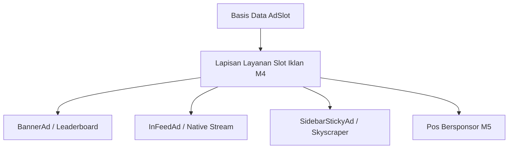

# 🎨 Panduan Desain Awesomic Zinc & Strategi Monetisasi (M1-M5)

Dokumen ini menguraikan penerapan sistem desain **Awesomic Zinc & Ember Style** (sesuai spesifikasi `DESIGN.md`) serta integrasi slot periklanan dan kemitraan bersponsor.

---

## 1. Filosofi Desain Awesomic

Awesomic beroperasi pada register visual netral yang sangat terkontrol: skala abu-abu zinc membawa hampir seluruh antarmuka, dengan satu aksen badge oranye (`#ff5a00`) dan hampir tanpa intrusi warna lainnya.

### Token Warna Inti (`DESIGN.md`)
- **Obsidian (`#09090b`)**: Tombol aksi utama, headline hero — hitam terdalam yang mengikat setiap CTA terhadap kanvas terang.
- **Paper (`#f4f4f5`)**: Latar belakang kanvas abu-abu hangat-sejuk yang membawa permukaan halaman.
- **Snow (`#ffffff`)**: Kartu terangkat di atas kanvas dengan garis batas `#ececee` 1px.
- **Ember (`#ff5a00`)**: Aksen tunggal untuk badge sorotan, penanda pos bersponsor, dan tag kredibilitas.
- **Graphite (`#18181b`)**: Teks isi tubuh artikel (14–15px).
- **Steel (`#52525b`) & Fog (`#71717a`)**: Teks pendukung dan metadata.

### Geometri & Elevasi
- **Radii**: 36px untuk kontainer kartu, 14px untuk tombol dan input, 12px untuk badge tag, 10000px untuk pil tombol navigasi.
- **Elevasi Hairline**: Garis batas `1px solid #ececee` menggantikan drop shadow sebagai alat pembeda permukaan utama.
- **Tombol Gelap Utama**: Memiliki bayangan inset highlight halus (`inset 0 0.5px 0 0 rgba(255,255,255,0.5), 0 0 0 1.5px rgb(44,46,52)`).

---

## 2. Arsitektur Monetisasi & Penempatan Iklan (M1 - M5)

Sesuai keputusan arsitektur (M1, M3, M4, M5), sistem periklanan bersifat terpusat dan modular:

### A. Slot Billboard / Leaderboard (`BannerAd.tsx`)
- Ditempatkan di antara bagian utama beranda dan di bawah isi artikel longform.
- Desain kartu membulat 36px dengan garis batas 1px hairline dan tag sponsor eksplisit.

### B. Slot Native In-Feed (`InFeedAd.tsx`)
- Disisipkan secara alami di antara kisi kartu artikel editorial.
- Menggunakan lencana `#AD / IKLAN` atau `SPONSORED` tanpa merusak keterbacaan visual.

### C. Slot Kolom Samping Lekat (`SidebarStickyAd.tsx`)
- Ditempatkan di bilah samping kanan (*sticky sidebar*) di samping artikel arsitektur panjang.
- Mengikuti pembaca saat menggulir naskah dokumen.

### D. Pos Bersponsor / Advertorial (`isSponsored: true`)
- **Penanda Transparan**: Wajib memiliki badge Ember `POS BERSPONSOR: SponsorName` di kartu dan di atas judul artikel.
- **Pengecualian Feed (M5)**: Secara otomatis dikeluarkan dari RSS feed utama (`/feed.xml`) dan halaman seri kurasi untuk menjaga kemurnian editorial.
