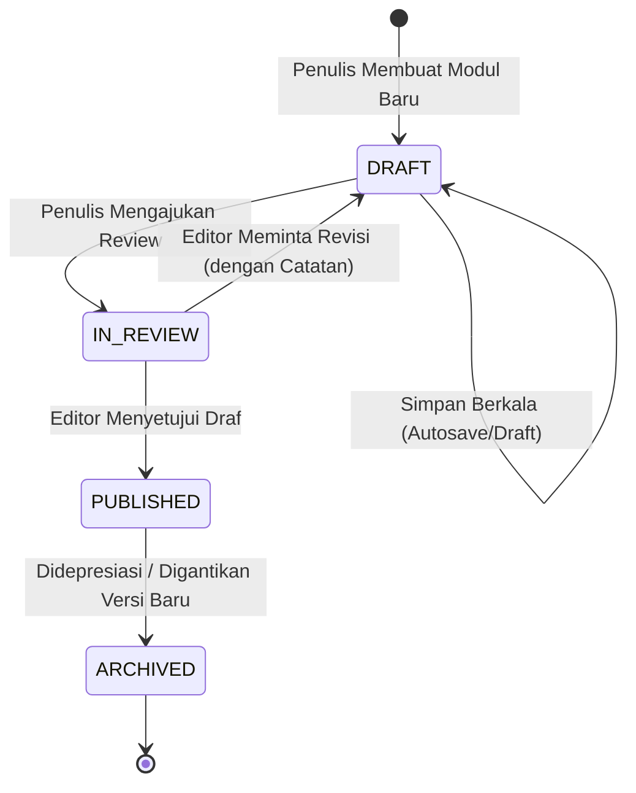

# ✍️ Alur Kerja Redaksi, Slash Editor & Antrean Review

Dokumen ini menjelaskan alur penulisan, peninjauan, persetujuan modul teknis, dan manajemen riwayat revisi dokumen.

---

## 1. Alur Siklus Hidup Dokumen (Document Lifecycle)

---

## 2. Fitur Notion-Style Slash Editor

Saat menyunting di dalam `<SlashEditor>`, mengetik karakter `/` memicu menu popup cerdas untuk menyisipkan berbagai blok elemen tanpa perlu mengingat sintaks markdown manual:

- `/h2` & `/h3` ➔ Menyisipkan Subjudul bab & sub-bagian
- `/mermaid` ➔ Menyisipkan template sequence diagram
- `/tabs` ➔ Menyisipkan blok kode multi-bahasa
- `/callout` ➔ Menyisipkan kotak catatan arsitektur
- `/wikilink` ➔ Menyisipkan tautan konsep `[[...]]`
- `/table` ➔ Menyisipkan tabel data perbandingan sistem

### Mode Tampilan Terpisah (Split-Pane Live Preview)
Penulis dapat beralih antara 3 mode kerja:
1. **Edit**: Fokus murni pada penulisan kode markdown.
2. **Split**: Penulisan di sisi kiri dengan pratinjau rendering waktu nyata di sisi kanan.
3. **Preview**: Pratinjau penuh halaman sebagaimana yang akan dilihat oleh pembaca publik.

---

## 3. Manajemen Snapshot Revisi (`DocRevision`)

Setiap kali modul diperbarui atau berpindah status, snapshot keadaan teks dokumen disimpan ke tabel `DocRevision`. Hal ini memungkinkan pelacakan historis perubahan arsitektur (*audit trail*) dan perbandingan diff antar versi.
