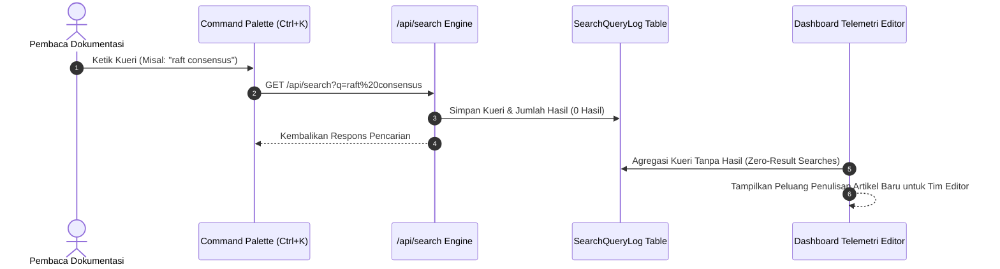

# 🔍 Pengalaman Pembaca, Command Palette & Telemetri Pencarian

Dokumen ini menjelaskan rancangan interaksi pembaca, navigasi cepat Command Palette, sistem bookmark pribadi, dan analisis telemetri kesenjangan konten.

---

## 1. Command Palette (`Ctrl+K` / `Cmd+K`)

Pembaca dapat membuka antarmuka pencarian cepat dari halaman mana saja dengan menekan shortcut `Ctrl+K` pada Windows/Linux atau `Cmd+K` pada macOS.

### Kapabilitas Command Palette:
- **Pencarian Multi-Entitas**: Mencari artikel modul dokumentasi dan istilah kamus glosarium secara serentak.
- **Navigasi Keyboard Penuh**: Dukungan tombol panah $\uparrow / \downarrow$, `ENTER` untuk membuka, dan `ESC` untuk menutup.
- **Rekomendasi Konsep Populer**: Menampilkan istilah arsitektur kunci saat kolom input masih kosong.

---

## 2. Telemetri Kesenjangan Konten (*Content Gap Telemetry*)

Setiap kali pengguna melakukan pencarian melalui Command Palette, kueri beserta jumlah hasil temuan dicatat ke tabel `SearchQueryLog`.

Wawasan ini memberikan data nyata kepada tim redaksi mengenai materi teknis apa yang paling banyak dicari oleh komunitas perekayasa namun belum memiliki bab dokumentasi resmi di platform.

---

## 3. Fitur Interaksi Pembaca

1. **Pustaka Bookmark (`/bookmarks`)**: Pembaca terautentikasi dapat menyimpan bab dokumentasi favorit untuk dibaca kembali sewaktu-waktu.
2. **Evaluasi Kualitas Dokumen ("👍 / 👎")**: Umpan balik langsung untuk mengukur kejelasan materi arsitektur.
3. **Reaksi Emoji Ekspresif (`🚀`, `💡`, `❤️`, `🔥`, `👏`)**: Peningkatan keterlibatan pembaca tanpa gesekan.
4. **Diskusi Teknis Auto-Approved**: Forum tanya jawab dan catatan implementasi antar perekayasa dengan sistem anti-spam terintegrasi.
