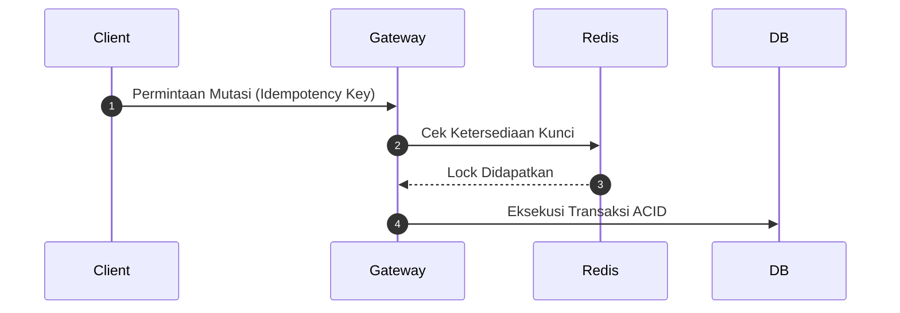

# 🔮 Mesin Wiki, Wikilinks & Diagram Interaktif

Dokumen ini menjelaskan spesifikasi teknis mesin konten SlashKB, mencakup parser tautan dua arah `[[WikiLink]]`, rendering diagram dinamis Mermaid.js, dan blok kode multi-bahasa.

---

## 1. Spesifikasi Sintaks [[WikiLink]]

Penulis dapat menautkan konsep glosarium atau dokumen lain dengan menggunakan kurung siku ganda:

- Sintaks Dasar: `[[idempotency-key]]`
- Sintaks Custom Label: `[[circuit-breaker-pattern|Pola Circuit Breaker]]`

### Mekanisme Ekstraksi & Pratinjau Popover:
1. Regex `/\[\[(.*?)\]\]/g` mengekstrak target slug.
2. Server meresolusi slug ke `GlossaryTerm` dan `DocArticle`.
3. Komponen `<WikiLinkPopover>` merender kartu mengambang (*floating card*) berisi judul istilah, kategori, dan ringkasan definisi saat pointer mouse berada di atas tautan.

---

## 2. Rendering Diagram Arsitektur (Mermaid.js)

Penulis dapat menyisipkan blok kode diagram alur, sequence, ERD, atau status diagram menggunakan deklarasi ` ```mermaid `:

````markdown

````

### Fitur Interaktif Komponen `<MermaidDiagram>`:
- **Zoom In / Zoom Out / Reset**: Memungkinkan inspeksi diagram arsitektur yang kompleks.
- **Salin Kode Mermaid**: Menyalin struktur kode sumber diagram dalam satu klik.
- **Tema Adaptif**: Warna diagram disesuaikan otomatis saat berganti antara Dark Mode dan Light Mode.

---

## 3. Cuplikan Kode Multi-Bahasa Bertab (` ```tabs `)

Untuk materi rekayasa yang relevan di berbagai ekosistem, penulis dapat menulis contoh implementasi dalam beberapa bahasa sekaligus:

````markdown
```tabs
// tab: TypeScript (Next.js)
export async function handler() { return true; }
// tab: Go (Golang)
func Handler() bool { return true }
// tab: Python (FastAPI)
def handler(): return True
```
````

Komponen `<MultiTabCode>` memisahkan setiap tab dengan tombol pemilihan bahasa ber-ikon, penomoran baris rapi, dan tombol salin instan.
